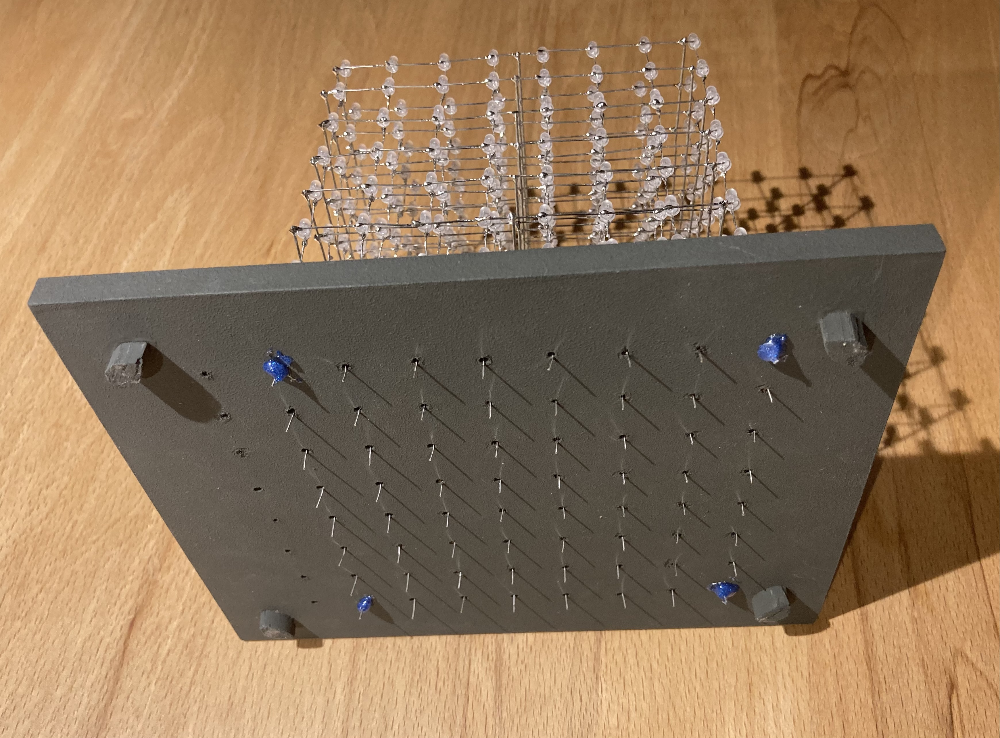
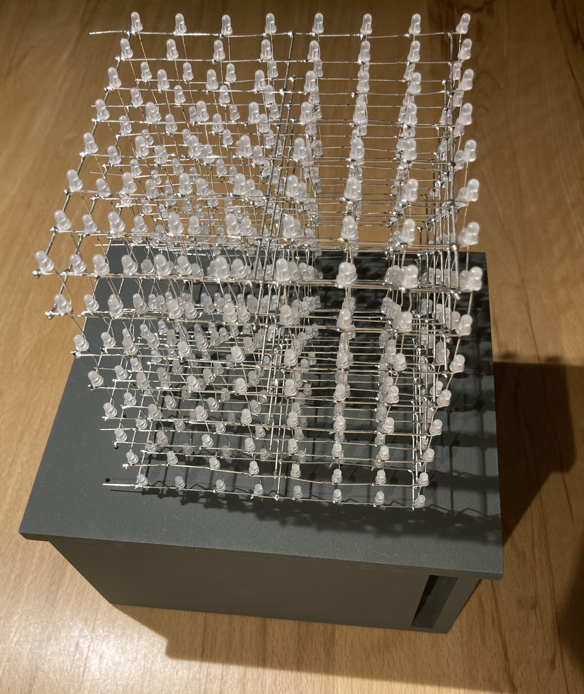
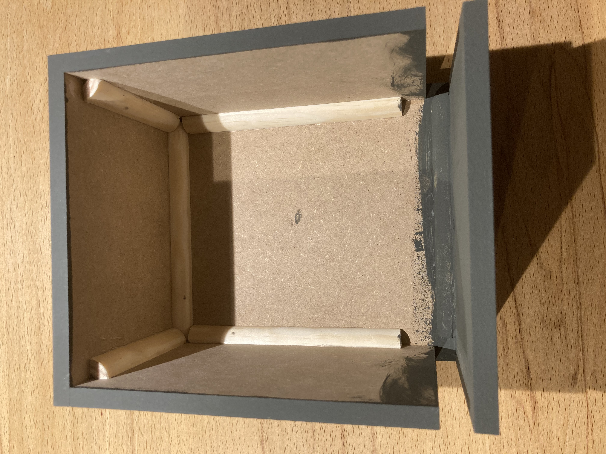

# LEDCube

## List of material
* [1 x Arduino Uno or Nano](https://de.aliexpress.com/item/1005001878048890.html?spm=a2g0o.order_detail.order_detail_item.13.6cad6368ZTXRm9&gatewayAdapt=glo2deu)
* [512 + some x LEDs 3mm](https://de.aliexpress.com/item/1005001473932316.html?spm=a2g0o.order_detail.order_detail_item.15.6cad6368ZTXRm9&gatewayAdapt=glo2deu)
* [1 x PCB Board 15x9cm](https://de.aliexpress.com/item/1005001436927943.html?spm=a2g0o.order_detail.order_detail_item.5.6cad6368ZTXRm9&gatewayAdapt=glo2deu)
* [9 x Shift Register 74HC595](https://de.aliexpress.com/item/1005001436954740.html?spm=a2g0o.order_detail.order_detail_item.11.6cad6368ZTXRm9&gatewayAdapt=glo2deu)
* [9 x 16 Pin Sockets](https://de.aliexpress.com/item/1005001487944120.html?spm=a2g0o.order_detail.order_detail_item.3.6cad6368ZTXRm9&gatewayAdapt=glo2deu)
* [64 x 150 Ohm Resistors](https://de.aliexpress.com/item/1005001437008358.html?spm=a2g0o.order_detail.order_detail_item.9.6cad6368ZTXRm9&gatewayAdapt=glo2deu)
* [8 x 1 kOhm Resistor](https://de.aliexpress.com/item/1005001437008358.html?spm=a2g0o.order_detail.order_detail_item.9.6cad6368ZTXRm9&gatewayAdapt=glo2deu)
* [16 x PN2222 Transistor](https://de.aliexpress.com/item/1005003658851112.html?spm=a2g0o.order_detail.order_detail_item.19.6cad6368ZTXRm9&gatewayAdapt=glo2deu)
* [some connector cables](https://de.aliexpress.com/item/1005005450651432.html?spm=a2g0o.productlist.main.9.103a17b2ulA96X&algo_pvid=ab61fd9b-dfb8-4897-b13f-e6e2dca24305&aem_p4p_detail=2023071301232818016149544652780004560294&algo_exp_id=ab61fd9b-dfb8-4897-b13f-e6e2dca24305-4&pdp_npi=3%40dis%21EUR%2126.62%2113.31%21%21%2128.98%21%21%40212279a216892366089321222d0763%2112000033130472143%21sea%21DE%214642985116&curPageLogUid=J963hGJ6L4yb&search_p4p_id=2023071301232818016149544652780004560294_5)
* [Some Jumper Cable](https://de.aliexpress.com/item/1005005202872082.html?spm=a2g0o.productlist.main.57.fce51b8bFP95Ew&algo_pvid=51e1d574-0d35-4719-9e9b-d4a07511cc7d&algo_exp_id=51e1d574-0d35-4719-9e9b-d4a07511cc7d-28&pdp_npi=3%40dis%21EUR%215.91%213.25%21%21%216.43%21%21%40211bc71916892369054005802d0745%2112000032137211016%21sea%21DE%214642985116&curPageLogUid=thxF18HWG1jr)
* [5 m silver wire AWG 20]()
* [1,5 m ribbon wire (at least 8 lines)](https://de.aliexpress.com/item/4000512709968.html?spm=a2g0o.productlist.main.1.103a17b2ulA96X&algo_pvid=ab61fd9b-dfb8-4897-b13f-e6e2dca24305&aem_p4p_detail=2023071301232818016149544652780004560294&algo_exp_id=ab61fd9b-dfb8-4897-b13f-e6e2dca24305-0&pdp_npi=3%40dis%21EUR%212.18%212.0%21%21%212.37%21%21%40212279a216892366089321222d0763%2110000002519030801%21sea%21DE%214642985116&curPageLogUid=4DD98tPOlaHY&search_p4p_id=2023071301232818016149544652780004560294_1)
* [wooden board to solder LEDs]()
* [MDF wood board for box 0,8 cm](https://www.bauhaus.info/mdf-platten-spanplatten/mdf-platte-fixmass/p/27586147)
* [glue](https://www.bauhaus.info/holzleim/uhu-holzleim-express/p/15352478)
* [220V -> 5V DC Converter 25 Watt](https://de.aliexpress.com/item/1005002728038351.html?spm=a2g0o.productlist.main.9.33e22abbYtRscF&algo_pvid=78537259-0ba4-45bd-9b2b-2a31bb7ac70e&aem_p4p_detail=202307130131021052335078441780000851636&algo_exp_id=78537259-0ba4-45bd-9b2b-2a31bb7ac70e-4&pdp_npi=3%40dis%21EUR%2125.07%2115.54%21%21%2127.29%21%21%40211bc2a016892370620011734d0760%2112000021885984898%21sea%21DE%214642985116&curPageLogUid=PqoolYpTra3N&search_p4p_id=202307130131021052335078441780000851636_5)
* [Power cable](https://de.aliexpress.com/item/32952916891.html?spm=a2g0o.productlist.main.13.636175002e4DNW&algo_pvid=197b014d-c89f-4147-8739-56f539c7782b&aem_p4p_detail=20230713013342483461753440380000856720&algo_exp_id=197b014d-c89f-4147-8739-56f539c7782b-6&pdp_npi=3%40dis%21EUR%210.53%210.47%21%21%210.58%21%21%40211bf12316892372219834341d07ad%2166353653619%21sea%21DE%214642985116&curPageLogUid=hS602v7tIT7l&search_p4p_id=20230713013342483461753440380000856720_7)

## List of tools
* Solder iron + solder
* Jigsaw
* Paint + Brush
* Drill 2 mm + 3mm
* Breadboard to test your circuit

## 8x8x8 LED Matrix
 

## Prototyped Board with 9 shift registers
 

## Wooden Box to hold matrix and install the PCB

